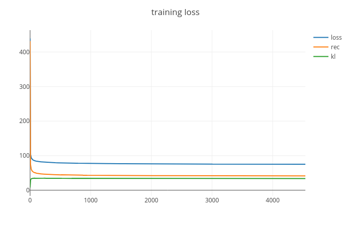
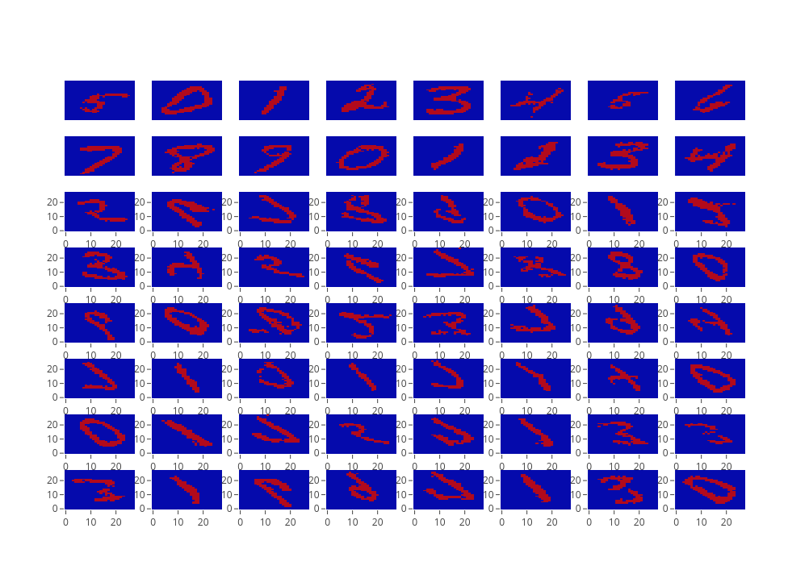

# variational-autoencoder
PyTorch Implementation of a Variational Autoencoder

Both the CNN and the normal feedforward autoencder are trained on MNIST dataset.
Note that, only a PyTorch implementation is provided. Moreover, the encoder produce the logit, which are then used by a Bernoulli distribution to sample black and white images.
If the problem is continuous, a Gaussian distribution is more appropriate.

##Theory
It is a generative model rooted in Bayesian inference theory and Variational inference. \
The idea is to generate a data-points from a given latent variable that encode the type of data we want to generate. 
For example, say, we want to generate an animal. First, we imagine the animal: it must have four legs, and it must be able to swim. 
Having those criteria, we could then actually generate the animal by sampling from the animal kingdom. 

Let use define some notation:

: data point

: latent variable

: probability distribution of the data

: probability of the latent variable indicating the type of data we generate

: distribution of the generating data given latent variable. E.g. turning imagination into real animal 

In variational Inference we resort to some information theory concepts: 
1. **Information** associated to an event is quantified as: 
2. **Entropy** is known as the average information, or the expectation of the information: 
3. **KL divergence** is a measure of dissimilarity of one distribution w.r.t. an other distribution: 
Note that:  and 

In Variational Autoencoder we are interested in generating new data; thus we are interested in the posterior distribution . 
Assuming to know the such posterior, we can infer our latent variable distribution  by marginalisation over our dataset. 
his make a lot of sense if we think about it: we want to make our latent variable likely under our data so to generate  plausible data. 

According to Bayesian theory: .
However, computing  is complicated, since:  is a marginal distribution which is intractable. If z is high dimensional,  we have to marginalise on all latent variables: .

In variational inference we **approximate  by an other distribution **. 
The intuition is to give at  a tractable form (Gaussian exponential) and "play" with the parameters of 
 so to match . 

Formally, we can rewrite our goal as: 

. 

Note that  has no relation with the latent variable z. Similarly,  because  is given.

Note that  is a constant since  is given. Also, note that  was the quantity I wanted to minimise. Thus, **minimising the KL divergence is equal to maximise  (Variational lower bound) up to a constant value.** 
The advantage is the variational lower bound  is tractable.

In Variational Autoencoder we define  and  as neural networks; moreover, we assume  to be a normal Gaussian distribution with unit variance and zero mean.

## Results
Based on the code, we have trained a CNN-based Variational Autoencoder on the MNIST dataset.
[Fig.1](loss) report the training loss, while Fig. 2 shows us some generated example.
As it is possible to see, there are still some artifact. Maybe a better activation function would provide better results.

  
  
  <a name=loss>Fig.1 - Training loss </a>

  
  
  <a name=new-example>Fig.2 - Generated examples</a>

